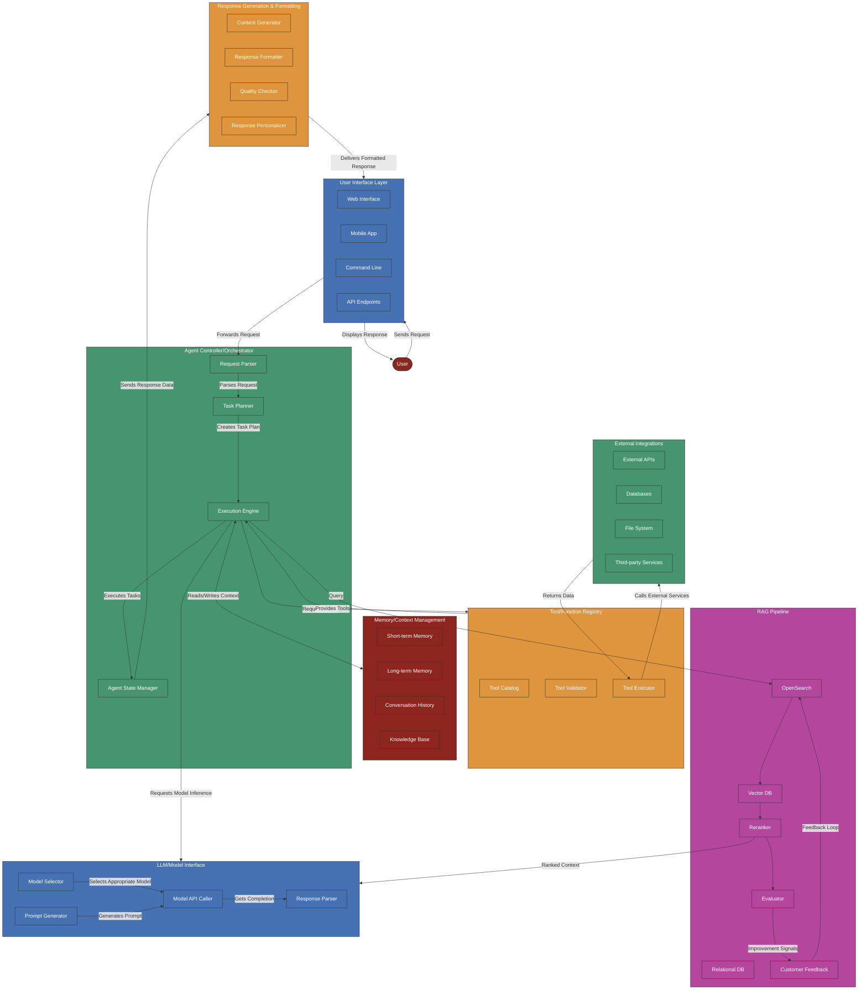

# Mock Agent Architecture

This diagram illustrates the overall agent system with an explicit Retrieval-Augmented Generation (RAG) pipeline.

```mermaid
flowchart TD
    subgraph UI["User Interface Layer"]
        UI_Web["Web Interface"]
        UI_Mobile["Mobile App"]
        UI_CLI["Command Line"]
        UI_API["API Endpoints"]
    end

    subgraph Controller["Agent Controller/Orchestrator"]
        RequestParser["Request Parser"]
        TaskPlanner["Task Planner"]
        ExecutionEngine["Execution Engine"]
        StateManager["Agent State Manager"]
    end

    subgraph ToolRegistry["Tool/Function Registry"]
        ToolCatalog["Tool Catalog"]
        ToolValidator["Tool Validator"]
        ToolExecutor["Tool Executor"]
    end

    subgraph Memory["Memory/Context Management"]
        ShortTermMem["Short-term Memory"]
        LongTermMem["Long-term Memory"]
        ConversationHistory["Conversation History"]
        KnowledgeBase["Knowledge Base"]
    end

    %% ---------------- RAG PIPELINE ----------------
    subgraph RAG["RAG Pipeline"]
        RAG_OpenSearch["OpenSearch"]
        RAG_VectorDB["Vector DB"]
        RAG_RelDB["Relational DB"]
        RAG_Reranker["Reranker"]
        RAG_Eval["Evaluator"]
        RAG_Feedback["Customer Feedback"]
    end

    subgraph ModelInterface["LLM/Model Interface"]
        ModelSelector["Model Selector"]
        PromptGenerator["Prompt Generator"]
        ModelCaller["Model API Caller"]
        ResponseParser["Response Parser"]
    end

    subgraph ExternalIntegrations["External Integrations"]
        APIs["External APIs"]
        Databases["Databases"]
        FileSystem["File System"]
        ThirdPartyServices["Third-party Services"]
    end

    subgraph ResponseGen["Response Generation & Formatting"]
        ContentGenerator["Content Generator"]
        Formatter["Response Formatter"]
        QualityChecker["Quality Checker"]
        Personalizer["Response Personalizer"]
    end

    %% Data Flow
    User(["User"]) -->|"Sends Request"| UI
    UI -->|"Forwards Request"| RequestParser
    RequestParser -->|"Parses Request"| TaskPlanner
    TaskPlanner -->|"Creates Task Plan"| ExecutionEngine
    ExecutionEngine -->|"Executes Tasks"| StateManager
    
    ExecutionEngine -->|"Requests Tools"| ToolRegistry
    ToolRegistry -->|"Provides Tools"| ExecutionEngine
    ToolExecutor -->|"Calls External Services"| ExternalIntegrations
    ExternalIntegrations -->|"Returns Data"| ToolExecutor
    
    ExecutionEngine <-->|"Reads/Writes Context"| Memory
    
    %% RAG data-flow
    ExecutionEngine -->|"Query"| RAG_OpenSearch
    RAG_OpenSearch --> RAG_VectorDB
    RAG_VectorDB --> RAG_Reranker
    RAG_Reranker --> RAG_Eval
    RAG_Eval -->|"Improvement Signals"| RAG_Feedback
    RAG_Feedback -->|"Feedback Loop"| RAG_OpenSearch
    RAG_Reranker -->|"Ranked Context"| ModelInterface

    ExecutionEngine -->|"Requests Model Inference"| ModelInterface
    ModelSelector -->|"Selects Appropriate Model"| ModelCaller
    PromptGenerator -->|"Generates Prompt"| ModelCaller
    ModelCaller -->|"Gets Completion"| ResponseParser
    
    StateManager -->|"Sends Response Data"| ResponseGen
    ResponseGen -->|"Delivers Formatted Response"| UI
    UI -->|"Displays Response"| User

    %% Styling
    classDef uiColor fill:#4672b4,color:white,stroke:#333,stroke-width:1px
    classDef controllerColor fill:#47956f,color:white,stroke:#333,stroke-width:1px
    classDef toolColor fill:#de953e,color:white,stroke:#333,stroke-width:1px
    classDef memoryColor fill:#8b251e,color:white,stroke:#333,stroke-width:1px
    classDef modelColor fill:#4672b4,color:white,stroke:#333,stroke-width:1px
    classDef externalColor fill:#47956f,color:white,stroke:#333,stroke-width:1px
    classDef responseColor fill:#de953e,color:white,stroke:#333,stroke-width:1px
    classDef ragColor fill:#b4479d,color:white,stroke:#333,stroke-width:1px
    classDef userColor fill:#8b251e,color:white,stroke:#333,stroke-width:1px

    class UI,UI_Web,UI_Mobile,UI_CLI,UI_API uiColor
    class Controller,RequestParser,TaskPlanner,ExecutionEngine,StateManager controllerColor
    class ToolRegistry,ToolCatalog,ToolValidator,ToolExecutor toolColor
    class Memory,ShortTermMem,LongTermMem,ConversationHistory,KnowledgeBase memoryColor
    class ModelInterface,ModelSelector,PromptGenerator,ModelCaller,ResponseParser modelColor
    class ExternalIntegrations,APIs,Databases,FileSystem,ThirdPartyServices externalColor
    class ResponseGen,ContentGenerator,Formatter,QualityChecker,Personalizer responseColor
    class RAG,RAG_OpenSearch,RAG_VectorDB,RAG_RelDB,RAG_Reranker,RAG_Eval,RAG_Feedback ragColor
    class User userColor

```
