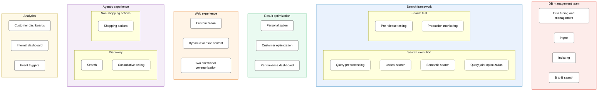

# Org Diagram from Bullet Points (Colored)

```mermaid
graph TB

  subgraph DB[DB management team]
    DB1[Infra tuning and management]
    DB2[Ingest]
    DB3[Indexing]
    DB4[B to B search]
  end

  subgraph SF[Search framework]
    subgraph SFE[Search execution]
      SFE1[Query preprocessing]
      SFE2[Lexical search]
      SFE3[Semantic search]
      SFE4[Query joint optimization]
    end
    subgraph SFT[Search test]
      SFT1[Pre release testing]
      SFT2[Production monitoring]
    end
  end

  subgraph RO[Result optimization]
    RO1[Personalization]
    RO2[Customer optimization]
    RO3[Performance dashboard]
  end

  subgraph WE[Web experience]
    WE1[Customization]
    WE2[Dynamic website content]
    WE3[Two directional communication]
  end

  subgraph AX[Agentic experience]
    subgraph AXD[Discovery]
      AXD1[Search]
      AXD2[Consultative selling]
    end
    subgraph AXN[Non shopping actions]
      AXN1[Shopping actions]
    end
  end

  subgraph AN[Analytics]
    AN1[Customer dashboards]
    AN2[Internal dashboard]
    AN3[Event triggers]
  end

  %% Colors for top level groups
  style DB fill:#fdecea,stroke:#e74c3c,stroke-width:1px,color:#000
  style SF fill:#eaf2fd,stroke:#2e86c1,stroke-width:1px,color:#000
  style RO fill:#eafaf1,stroke:#27ae60,stroke-width:1px,color:#000
  style WE fill:#fff4e6,stroke:#e67e22,stroke-width:1px,color:#000
  style AX fill:#f5eef8,stroke:#8e44ad,stroke-width:1px,color:#000
  style AN fill:#fef9e7,stroke:#b7950b,stroke-width:1px,color:#000

  %% Optional: make leaf nodes rounded
  classDef leaf stroke:#333,fill:#ffffff,rx:6,ry:6,color:#000
  class DB1,DB2,DB3,DB4,SFE1,SFE2,SFE3,SFE4,SFT1,SFT2,RO1,RO2,RO3,WE1,WE2,WE3,AXD1,AXD2,AXN1,AN1,AN2,AN3 leaf
```
