# First-Week Report  
## Role: VP of Engineering — Salesforce  
### Author: Eugene Fratkin  
### Date: <!-- 2025-07-25 -->

---

## 1. Onboarding  

_This section captures logistics, orientation sessions, and early introductions for week 1._

### 1.1 Logistics & Setup  
- Corporate system access (Okta, GitHub Enterprise, Jira): **TBD**  
- Hardware & workspace readiness: **TBD**  
- Development-environment configuration: **TBD**

### 1.2 Orientation Sessions  
| Session | Host | Date | Key Takeaways |
|---------|------|------|---------------|
| New-Hire Orientation | HR | **TBD** | **TBD** |
| Security & Compliance | CISO Office | **TBD** | **TBD** |
| Product Vision & Roadmap | CPO | **TBD** | **TBD** |

### 1.3 Early Introductions  
- 1:1 with **SVP Engineering** — topics: **TBD**  
- Meet & greet with peer VPs (Product, Sales, Customer Success)  
- Introduction to executive assistant & support staff  

---

## 2. Team  

### 2.1 Organizational Chart — Agentforce / Search & Intelligence

```mermaid
graph LR
    %%------------------  ROOT  ------------------
    VP["VP Engineering<br/>Eugene Fratkin"]

    %%------------------  DIRECT REPORTS  ------------------
    VP --> TarunB["Architect • Tarundeep Batra"]
    VP --> ReneB["Lead • Rene Borm"]
    VP --> SatyaD["Lead • Satya Duggirrala"]
    VP --> BrenH["Director • Brendon Hatch"]
    VP --> SumK["Sr Mgr • Sumanth Kondakindi"]
    VP --> LakshmiP["Sr Mgr • Lakshmi Reddy Papudippu"]

    %%------------------  TARUNDEEP BATRA  ------------------
    %% (No ICs explicitly shown in org image – placeholder)
    TarunB --> TB_P1["<i>ICs TBD</i>"]

    %%------------------  RENE BORM  ------------------
    %% (No ICs explicitly shown in org image – placeholder)
    ReneB --> RB_P1["<i>ICs TBD</i>"]

    %%------------------  SATYA DUGGIRRALA  ------------------
    %% (No ICs listed in image – placeholder)
    SatyaD --> SD_P1["<i>ICs TBD</i>"]

    %%------------------  BRENDON HATCH – CIP  ------------------
    BrenH --> LesterG["Lester Garcia Sierra"]
    BrenH --> AvinashK["Avinash Kasipathy"]
    BrenH --> VijayantiK["Vijayanti Kothandaraman"]
    BrenH --> ManeshL["Manesh Kumar Lohano"]
    BrenH --> JhalakM["Jhalak Mahansaria"]
    BrenH --> AjayS["Ajay Singh"]
    BrenH --> SamarthU["Samarth Urs"]

    %%------------------  LAKSHMI REDDY PAPUDIPPU  ------------------
    LakshmiP --> MalvikaC["Malvika Choudhary"]
    LakshmiP --> MohammadH["Mohammad Hussain"]
    LakshmiP --> AshutoshJ["Ashutosh Jain"]
    LakshmiP --> GauravK["Gaurav Khengar"]
    LakshmiP --> SoniaK["Sonia Kale"]
    LakshmiP --> RomitK["Romit Kumar"]
    LakshmiP --> SowmyaP["Sowmya Pittala"]
    LakshmiP --> NeeleshJ["Neelesh Jayour"]
    LakshmiP --> VikashS["Vikash Sharma"]
    LakshmiP --> PuneetT["Punit Tripathi"]
    LakshmiP --> StefanP["Stefan Piesche"]
    LakshmiP --> BalaR["Bala Ramakrishnan"]
    LakshmiP --> SakthivelR["Sakthivel Ramsamy"]
    LakshmiP --> PhilippeR["Philippe Riand"]
    LakshmiP --> BeckyS["Becky Schoen"]
    LakshmiP --> ArpitS["Arpit Shah"]
    LakshmiP --> RaviS["Ravi Shankar"]
    LakshmiP --> BhumikaS["Bhumika Sharma"]
    LakshmiP --> BenSt["Ben Stice"]
    LakshmiP --> MattVW["Matthew Van Wely"]

    %%------------------  SUMANTH KONDAKINDI  ------------------
    %% Managers
    SumK --> ColinB["Mgr • Colin Brazeau"]
    SumK --> ZaraC["Mgr • Zara Chiara Clark"]
    SumK --> CarlosD["Mgr • Carlos De La Torre"]
    SumK --> AndrewH["Mgr • Andrew Howe"]
    SumK --> SantoshK["Mgr • Santhosh Kumar KRS"]
    SumK --> SohiniM["Mgr • Sohini Majumdar"]
    SumK --> VikasK["Mgr • Vikas Kumar"]
    SumK --> NavidM["Mgr • Navid Mehrdad"]
    SumK --> AtulR["Mgr • Atul Ranjan"]
    SumK --> JohnL["Mgr • John Legelis"]
    SumK --> LitoS["Mgr • Lito Santana"]
    SumK --> ManikaM["Mgr • Manika Mehta"]
    SumK --> HuaS["Mgr • HuaSheng Su"]

        %% ---- Colin Brazeau team
        ColinB --> EdaA["Eda Aslanbabe"]
        ColinB --> RohitA["Rohit Awate"]
        ColinB --> ChrisC["Christopher Cordova"]
        ColinB --> VashiD["Vashi Dhankar"]
        ColinB --> ChristabelE["Christabel Escarez"]
        ColinB --> KristinaK["Kristina Kraft"]
        ColinB --> EricL["Eric Lim"]
        ColinB --> TejasN["Tejas Nadkarni"]
        ColinB --> DenizT["Deniz Turkapcar"]
        ColinB --> JenniferY["Jennifer Yang"]
        ColinB --> AnnZ["Ann Zhou"]

        %% ---- Zara Chiara Clark team
        ZaraC --> AndrewG["Andrew Ghazouli"]
        ZaraC --> MetinK["Metin Kilic"]
        ZaraC --> JohnMc["John McGouty"]
        ZaraC --> SnehaN["Sneha Nair"]
        ZaraC --> AkshayS["Akshay Kumar Sridharan"]
        ZaraC --> XiaoY["Xiaojing Yan"]

        %% ---- Sohini Majumdar team
        SohiniM --> SaiT["Sai Surya Teja Kemburu"]
        SohiniM --> DivyaM["Divya Maurya"]
        SohiniM --> NikhilM["Nikhil Maurya"]
        SohiniM --> SaiA["Sai Aman Reddy"]
        SohiniM --> PriyaS["Priya Singh"]
        SohiniM --> VijeshV["Vijesh Vishwakarma"]

        %% ---- Navid Mehrdad (no ICs in image) placeholder
        NavidM --> NavidP1["<i>ICs TBD</i>"]

        %% ---- Vikas Kumar (no ICs in image) placeholder
        VikasK --> VikasP1["<i>ICs TBD</i>"]

        %% ---- John Legelis (no ICs in image) placeholder
        JohnL --> JohnP1["<i>ICs TBD</i>"]

        %% ---- Manika Mehta (no ICs in image) placeholder
        ManikaM --> ManikaP1["<i>ICs TBD</i>"]

        %% ---- Atul Ranjan team
        AtulR --> NayanaA2["Nayana Aher"]
        AtulR --> DebankarB2["Debankar Banerjee"]
        AtulR --> VinayakB2["Vinayak Bhat"]
        AtulR --> PappuC2["Pappu Kumar Chaudhary"]
        AtulR --> ShilpiM2["Shilpi Mittal"]
        AtulR --> VaibhavP2["Vaibhav Pandey"]
        AtulR --> SharadS2["Sharad Sharma"]

        %% ---- Lito Santana (no ICs) placeholder
        LitoS --> LitoP1["<i>ICs TBD</i>"]

        %% ---- HuaSheng Su team
        HuaS --> LesterG2["Lester Garcia Sierra"]
        HuaS --> AvinashK2["Avinash Kasipathy"]
        HuaS --> VijayantiK2["Vijayanti Kothandaraman"]
        HuaS --> ManeshL2["Manesh Kumar Lohano"]
        HuaS --> JhalakM2["Jhalak Mahansaria"]
        HuaS --> JiyaS["Jiya Singh"]
        HuaS --> SamarthU2["Samarth Urs"]

    %%------------------  Styling  ------------------
    classDef lead fill:#eef6ff,stroke:#1f78b4,stroke-width:1px;
    classDef ic   fill:#ffffff,stroke:#bbbbbb,stroke-width:0.5px;
    class TarunB,ReneB,SatyaD,BrenH,SumK,LakshmiP lead
```

### 2.2 Key Insights  
- Organization spans **65 ICs and 8 managers** across US, India, and Germany.  
- Deep expertise in Search, E-commerce merchandising, and Data-intelligence platforms.  
 **2 open headcount** (1 Manager, 1 IC) yet to be hired.  

---

## 3. Initial Observations  

### 3.1 Strengths  
1. Deep domain expertise in search & recommendation systems.  
2. Mature CI/CD pipeline leveraging Jenkins & GitHub Actions.  
3. Collaborative culture with clear ownership boundaries.  

### 3.2 Opportunities  
| Area | Observation | Potential Impact |
|------|-------------|------------------|
| Technical Debt | Legacy monolith modules remain critical-path | Slows feature velocity |
| Documentation | Limited runbooks for on-call rotations | Longer MTTR |
| Hiring | 2 open roles (1 Mgr, 1 IC) across the org | Reliability risk / limited bandwidth |
### 3.3 Immediate Next Steps  
1. Complete 1:1s with all direct and skip-level managers (within 2 weeks).  
2. Publish engineering vision & FY OKRs (within 30 days).  
3. Establish dashboard tracking DORA & service-health metrics (within 60 days).  

---

_Last updated: <!-- auto-generated on commit -->_
